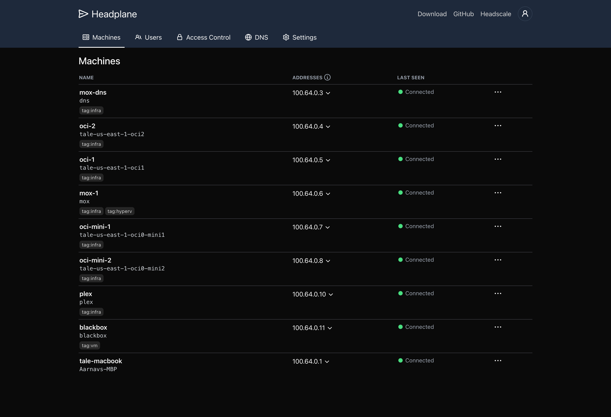

# Headplane
> A feature-complete web UI for [Headscale](https://headscale.net)

<picture>
    <source
        media="(prefers-color-scheme: dark)"
        srcset="./assets/preview-dark.png"
    >
    <source
        media="(prefers-color-scheme: light)"
        srcset="./assets/preview-light.png"
    >
    
</picture>

Headscale is the de-facto self-hosted version of Tailscale, a popular Wireguard
based VPN service. By default, it does not ship with a web UI, which is where
Headplane comes in. Headplane is a feature-complete web UI for Headscale, allowing
you to manage your nodes, networks, and ACLs with ease.

Headplane aims to replicate the functionality offered by the official Tailscale
product and dashboard, being one of the most feature complete Headscale UIs available.
These are some of the features that Headplane offers:

- Machine management, including expiry, network routing, name, and owner management
- Access Control List (ACL) and tagging configuration for ACL enforcement
- Support for OpenID Connect (OIDC) as a login provider
- The ability to edit DNS settings and automatically provision Headscale
- Configurability for Headscale's settings

## Deployment
Headplane runs as a server-based web-application, meaning you'll need a server to run it.
It's available as a Docker image (recommended) or through a manual installation.
There are 2 ways to deploy Headplane:

- ### [Integrated Mode (Recommended)](/docs/Integrated-Mode.md)
  Integrated mode unlocks all the features of Headplane and is the most
  feature-complete deployment method. It communicates with Headscale directly.

- ### [Simple Mode](/docs/Simple-Mode.md)
  Simple mode does not include the automatic management of DNS and Headplane
  settings, requiring manual editing and reloading when making changes.

## Contributing
Headplane is an open-source project and contributions are welcome! If you have
any suggestions, bug reports, or feature requests, please open an issue. Also
refer to the [contributor guidelines](./docs/CONTRIBUTING.md) for more info.

<picture>
    <source
        media="(prefers-color-scheme: dark)"
        srcset="./assets/acls-dark.png"
    >
    <source
        media="(prefers-color-scheme: light)"
        srcset="./assets/acls-light.png"
    >
    
</picture>

<picture>
    <source
        media="(prefers-color-scheme: dark)"
        srcset="./assets/machine-dark.png"
    >
    <source
        media="(prefers-color-scheme: light)"
        srcset="./assets/machine-light.png"
    >
    
</picture>

> Copyright (c) 2025 Aarnav Tale
