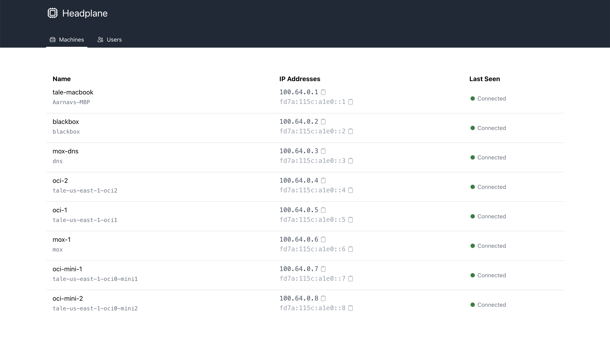

# Headplane
> An advanced UI for [juanfont/headscale](https://github.com/juanfont/headscale)

Headscale is a self-hosted version of the Tailscale control server, however, it currently lacks a first-party web UI.
This is a relatively tiny Remix app that aims to provide a usable GUI for the Headscale server.
It's still very early in it's development, however these are some of the features that are planned.

- [ ] Editable tags, machine names, users, etc
- [ ] ACL control through Docker integration
- [x] OIDC based login for the web UI
- [x] Automated API key regeneration
- [ ] Editable headscale configuration

## Deployment
Instructions for deploying this will come soon. It will utilize Docker to support advanced features.
If you do want to fight with the environment variables right now, the image is `ghcr.io/tale/headplane:latest`

## Contributing
If you would like to contribute, please install a relatively modern version of Node.js and PNPM.
Clone this repository, run `pnpm install`, and then run `pnpm dev` to start the development server.

> Copyright (c) 2024 Aarnav Tale
