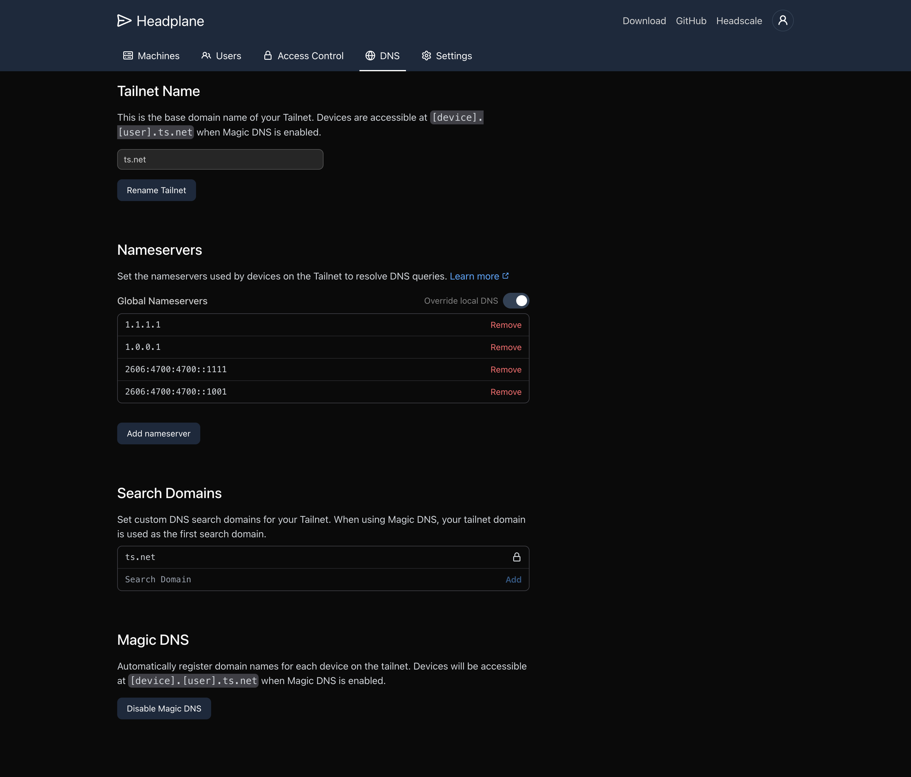

# Advanced Integration

The advanced integration methods unlock the full capabilities of Headplane.
This is the closest you can get to the SaaS experience if you were paying for
Tailscale.

### Configuration Management

<picture>
    <source
        media="(prefers-color-scheme: dark)"
        srcset="../assets/integration-dark.png"
    >
    <source
        media="(prefers-color-scheme: light)"
        srcset="../assets/integration-light.png"
    >
    
</picture>

The advanced integration allows you to manage the Headscale configuration via
the Headplane UI. When the configuration is available for editing, the `DNS`
and `Settings` tabs will become available. When using the Docker or Kubernetes
integration, changes to the configuration file will be automatically applied
to Headscale.

> By default, the configuration file is read from `/etc/headscale/config.yaml`.
This can be overridden by setting the `CONFIG_FILE` environment variable. Any
variables including `HEADSCALE_URL`, `OIDC_CLIENT_ID`, `OIDC_ISSUER`, and
`OIDC_CLIENT_SECRET` will take priority over the configuration file.

### Access Control Lists (ACLs)

<picture>
    <source
        media="(prefers-color-scheme: dark)"
        srcset="../assets/acls-dark.png"
    >
    <source
        media="(prefers-color-scheme: light)"
        srcset="../assets/acls-light.png"
    >
    
</picture>

The advanced integration allows you to manage the ACLs via the Headplane UI.
When the ACL file is available for editing, the `Access Controls` tab will
become available. All of the integrations support automatic reloading of the
ACLs when the file is changed.

> By default, the ACL file is read from `/etc/headscale/acl_policy.json`.
> If `policy.path` is set and `policy.mode` is set to `file`, the ACL file will
> be read from the path specified in the configuration file instead.

## Deployment

Requirements:
- Headscale 0.23 or newer
- Headscale and Headplane need a Reverse Proxy (NGINX, Traefik, Caddy, etc)

Currently there are 3 integration providers that can do this for you:
- [Docker Integration](/docs/integration/Docker.md)
- [Kubernetes Integration](/docs/integration/Kubernetes.md)
- [Native Linux Integration](/docs/integration/Native.md)

