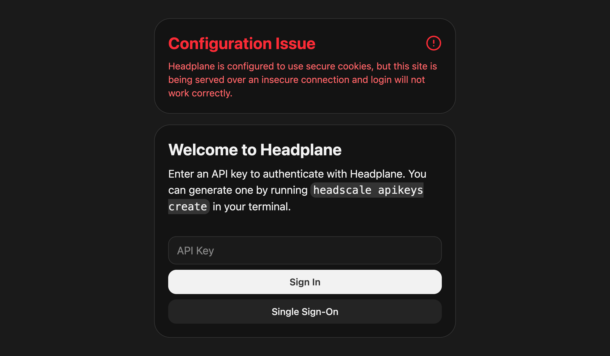
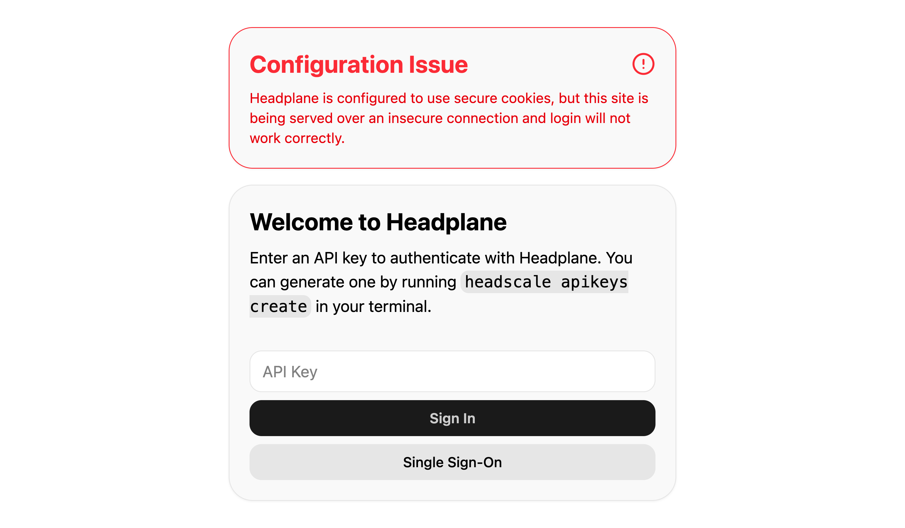

# Common Issues and Their Solutions
This document outlines some common issues users may encounter while using Headplane, along with their solutions.

## Login does not work
::: tip
Headplane tries to detect misconfigurations and will surface a warning banner on
the login page if it detects any abnormalities. You may see a banner like this:
<figure>
    
    
    <figcaption>Login Warning Banner</figcaption>
</figure>
:::

If you attempt to log in to Headplane but nothing happens, it may be due to a
misconfiguration of the server cookie settings. In your Headplane configuration,
ensure that `server.cookie_secure` is set appropriately based on how you are
accessing Headplane:
- Serving over HTTPS: `cookie_secure` should be enabled (`true`).
- Serving over HTTP: `cookie_secure` should be disabled (`false`).
