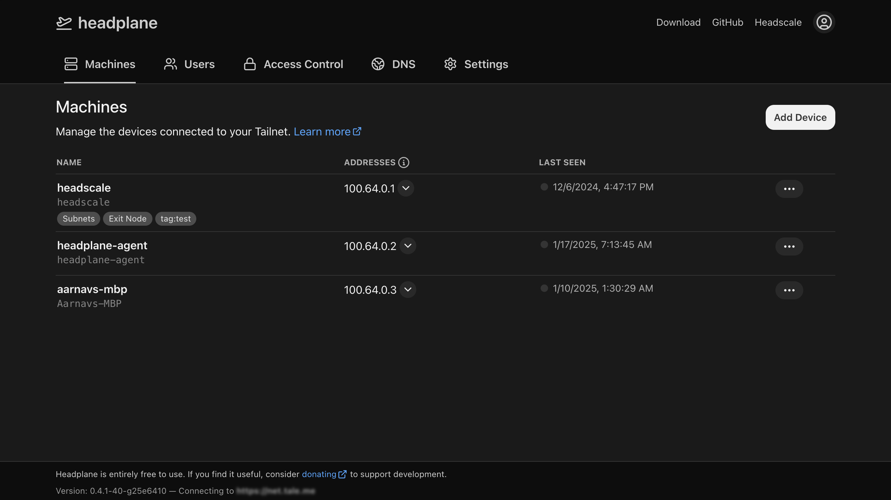
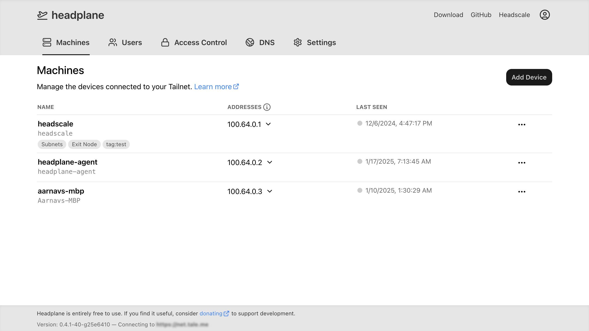
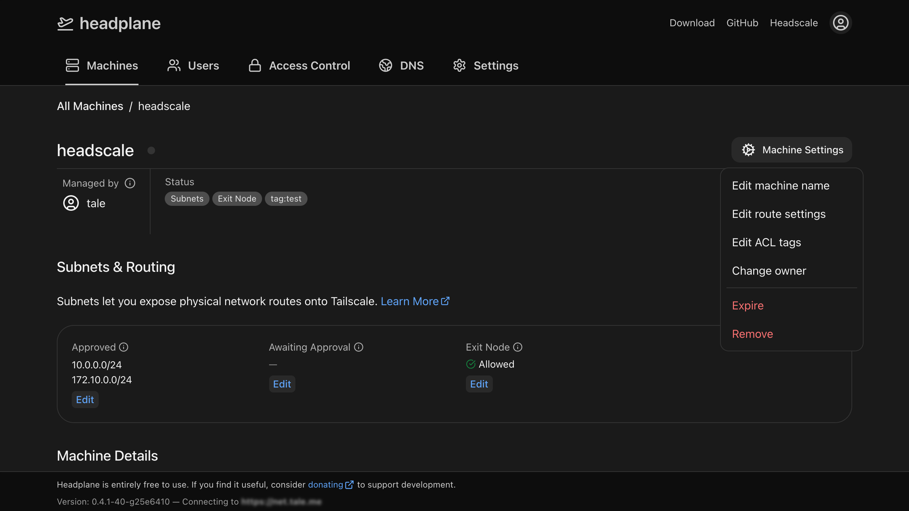
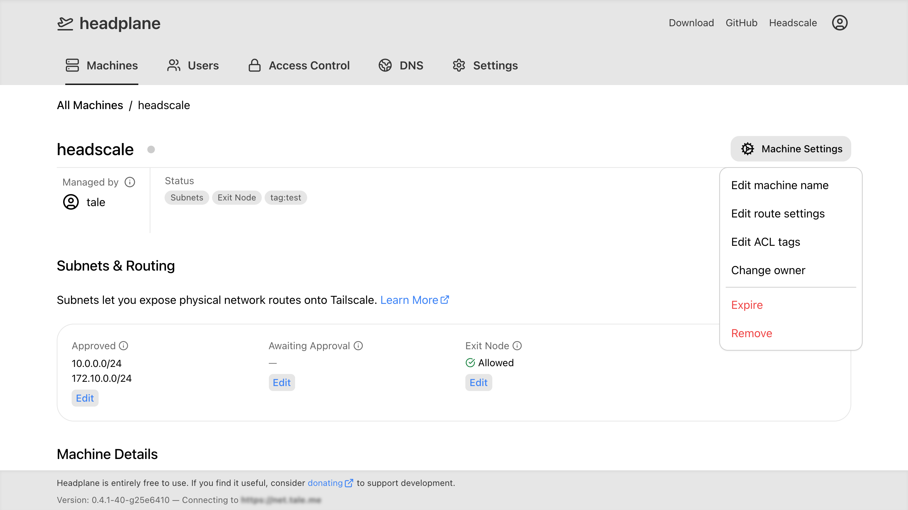

# Headplane Agent

The Headplane Agent is an optional component that periodically syncs node
information (such as version and OS details) from the Tailnet. Unlike previous
versions, the agent does not require you to manually create or manage pre-auth
keys — Headplane generates a fresh key for each agent startup and reuses the
agent's existing Tailnet state across restarts.

## Prerequisites

Before enabling the agent, ensure the following:

1. **Headscale 0.28 or newer** is required. The agent uses tag-only pre-auth
   keys which are only available in Headscale 0.28+.

2. **`headscale.api_key`** must be set in your Headplane configuration file.
   The agent uses this key to auto-generate pre-auth keys for connecting to the
   Tailnet and to auto-approve its own registration when Headscale is configured
   to require manual approval.

## Configuration

To enable the Headplane Agent, you'll need to modify the following fields in
your Headplane configuration file. For more information on configuring Headplane
please refer to the
[example configuration](https://github.com/tale/headplane/blob/main/config.example.yaml)
for details.

| Field                               | Description                                                                          |
| ----------------------------------- | ------------------------------------------------------------------------------------ |
| **`integration.agent.enabled`**     | Set to `true` to enable the agent.                                                   |
| `integration.agent.host_name`       | _Optional_. Headscale user name for the agent (default: `headplane-agent`).          |
| `integration.agent.cache_ttl`       | _Optional_. How often to sync in milliseconds (default: `180000` / 3 minutes).       |
| `integration.agent.work_dir`        | _Optional_. Working directory for the agent's tailnet state.                         |
| `integration.agent.executable_path` | _Optional_. Path to the agent binary (default: `/usr/libexec/headplane/agent`).      |
| `integration.agent.tailscale_netns` | _Optional_. Use Tailscale's network namespace routing protections (default: `true`). |

## Native Mode Configuration

Once you've built Headplane locally, there will be a binary in the `./build`
folder called `hp_agent`. Please move this binary to
`/usr/libexec/headplane/agent` and ensure that it is executable.

::: tip
If for some reason you cannot move the binary to the intended location, you can
define **`integration.agent.executable_path`** in your Headplane configuration
file to point to the correct location of the agent binary.
:::

The agent will also use `/var/lib/headplane/agent` as its data directory by
default. You can change this location by defining
**`integration.agent.work_dir`** in your Headplane configuration file. Ensure
that the specified directory exists and is writable by the user running
Headplane.

Headplane preserves the agent's `tailscaled.state` in this directory. This lets
the agent retain its Tailnet identity across Headplane restarts instead of
registering as a new host each time. If the agent's state is lost or unusable,
Headplane falls back to the pre-auth key and registers a new agent node.

## Tailscale network namespace handling

The agent uses Tailscale's network namespace routing protections by default.
This helps prevent routing loops and should remain enabled for most deployments,
especially when Headscale is reached through Tailscale.

In a restricted multi-network container, Tailscale may be unable to mark
sockets and may bind control traffic to the default-route interface even when
Headscale is directly reachable through another interface. After verifying
that the container's ordinary routing reaches Headscale correctly, the agent
can rely on that routing instead:

```yaml
integration:
  agent:
    enabled: true
    tailscale_netns: false
```

This setting affects only the Headplane agent process. It does not change the
Headplane server's networking behavior. Do not disable it unconditionally;
bare-metal and Tailscale-routed deployments may rely on its loop-prevention
behavior.

## Interactive approval

Under normal circumstances, the agent connects headlessly using the auto-generated
pre-auth key and no manual interaction is required. If your Headscale server is
configured to require interactive approval, Headplane detects the auth URL the
agent prints and automatically approves the request using the configured
`headscale.api_key`. The Settings page still shows the approval link as a
fallback in case auto-approval fails.

## Usage

<figure>
    
    
    <figcaption>Headplane Dashboard</figcaption>
</figure>

After enabling and configuring the Headplane Agent, restart your Headplane
instance. You should now see additional options in the UI, such as host
information about each node and the ability to open SSH sessions directly from
the browser if the nodes have Tailscale SSH enabled.

<figure>
    
    
    <figcaption>Machine page</figcaption>
</figure>
