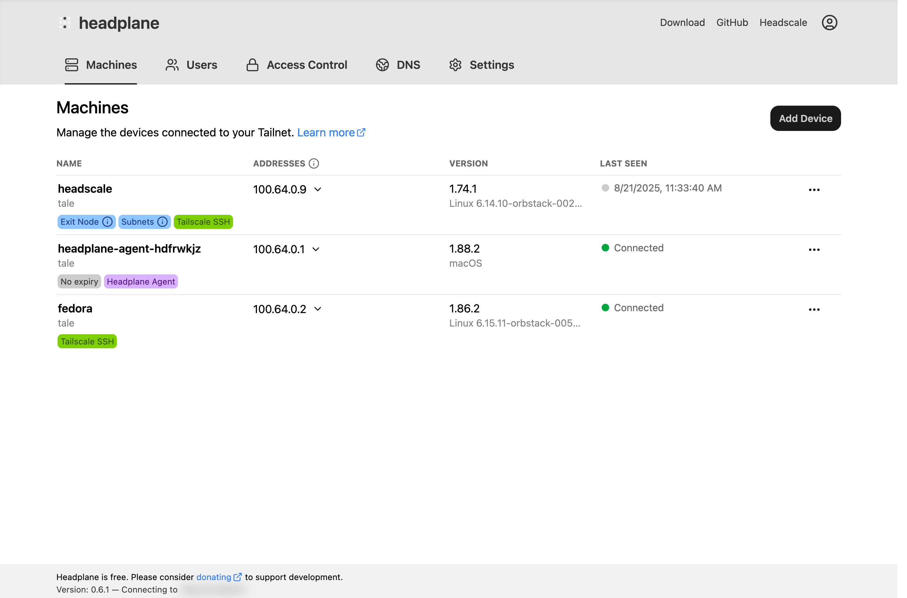
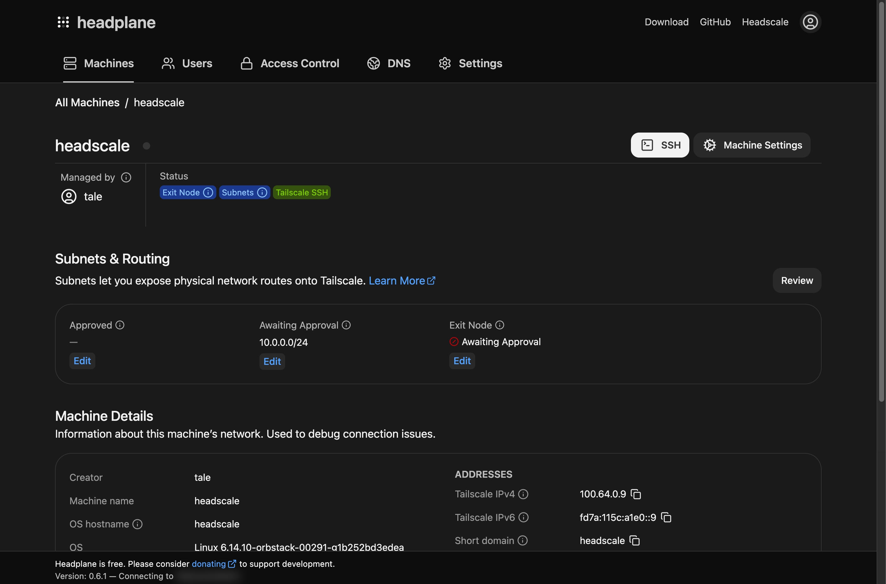

# Headplane Agent

<figure>
    
    <figcaption>SSH access via the browser</figcaption>
</figure>

The Headplane Agent is an optional component that can be enabled on your
Headplane instance in order to unlock additional features such as remote
web-based SSH and detailed machine information.

## Configuration

To enable the Headplane Agent, you'll need to modify the following fields in
your Headplane configuration file. For more information on configuring Headplane
please refer to the
[example configuration](https://github.com/tale/headplane/blob/main/config.example.yaml)
for details.

| Field               | Description                                            |
|---------------------|--------------------------------------------------------|
| **`integration.agent.enabled`** | Set to `true` to enable the agent. |
| **`integration.agent.pre_authkey`** | A reusable pre-auth-key (see below). |
| `integration.agent.host_name` | *Optional*. Host name to register as. |
| `integration.agent.cache_path` | *Optional*. Cache path for the agent. |
| `integration.agent.work_dir` | *Optional*. Working directory for the agent. |

## Native Mode Configuration
Once you've built Headplane locally, there will be a binary in the `./build`
folder called `hp_agent`. Please move this binary to
`/usr/libexec/headplane/agent` and ensure that it is executable.

::: tip
If for some reason you cannot move the binary to the intended location, you can
define **`integration.agent.executable_path`** in your Headplane configuration
file to point to the correct location of the agent binary.
:::

The agent will also use `/var/lib/headplane/agent` as its data directory by
default. You can change this location by defining
**`integration.agent.work_dir`** in your Headplane configuration file. Ensure
that the specified directory exists and is writable by the user running
Headplane.

## Usage

<figure>
    
    
    <figcaption>Headplane Dashboard</figcaption>
</figure>

After enabling and configuring the Headplane Agent, restart your Headplane
instance. You should now see additional options in the UI, such as host
information about each node and the ability to open SSH sessions directly from
the browser if the nodes have Tailscale SSH enabled.

<figure>
    
    
    <figcaption>Machine page</figcaption>
</figure>
