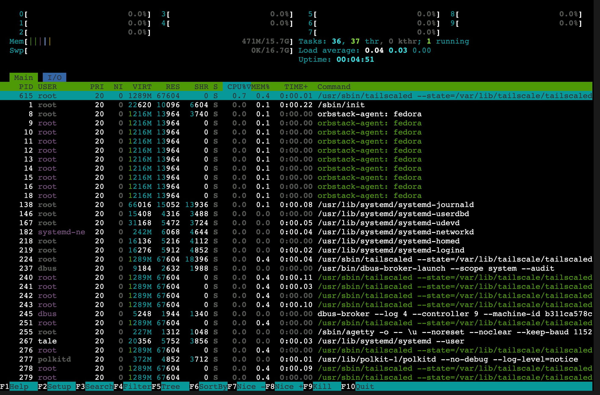

# WebSSH

<figure>
    
    <figcaption>SSH access via the browser</figcaption>
</figure>

WebSSH lets you open an SSH session to any node directly from the browser. It
uses a Go-based WASM shim that creates an ephemeral Tailscale node in the
browser and connects to the target node over the Tailnet.

## Prerequisites

- **Headscale 0.28 or newer** is required.
- Target nodes must have **Tailscale SSH** enabled.
- Users must be authenticated via **OIDC** (API key logins cannot use WebSSH).
- The **Headplane Agent** must be
  [enabled and configured](/features/agent) so that ephemeral node cleanup
  works correctly.
- The WASM assets (`hp_ssh.wasm` and `wasm_exec.js`) must be present in the
  build. These are built automatically by `./build.sh --wasm`.

## How It Works

When a user opens an SSH session from the UI, the browser:

1. Loads a Go WASM binary that implements a minimal Tailscale node.
2. Authenticates to the Tailnet using an ephemeral pre-auth key generated
   server-side.
3. Connects to the target node over the Tailnet using DERP relay servers.
4. Opens an SSH session and renders it in an [xterm.js](https://xtermjs.org)
   terminal.

The ephemeral node is automatically cleaned up after the session ends.

## DERP Servers on Non-Standard Ports

In the browser, Tailscale connects to DERP relay servers via WebSockets. If
your DERP servers run on a non-standard port (e.g. `:8443` instead of `:443`),
Headplane includes a patch to Tailscale's DERP client that preserves the port
in WebSocket URLs. This patch is applied automatically during the WASM build.

::: warning
If you are building the WASM module manually (outside of `build.sh`), make sure
to apply `patches/tailscale-derp-port.patch` to the vendored Tailscale source
before compiling. See the `build_wasm()` function in `build.sh` for reference.
:::

## Troubleshooting

### "WebSSH is not configured in this build"

The WASM assets are missing. Rebuild with `./build.sh --wasm` or ensure your
Docker image was built with the `--wasm` flag.

### "Only OAuth users are allowed to use WebSSH"

WebSSH requires OIDC authentication to generate pre-auth keys tied to a
Headscale user. API key logins do not have an associated Headscale user
identity.

### Connection hangs or fails to reach the node

- Verify that the target node has Tailscale SSH enabled.
- If using custom DERP servers on non-standard ports, ensure you are running
  a build that includes the DERP port patch (any build from `build.sh` or
  Docker includes it automatically).
- Check the browser console for WASM errors or DERP connection failures.
