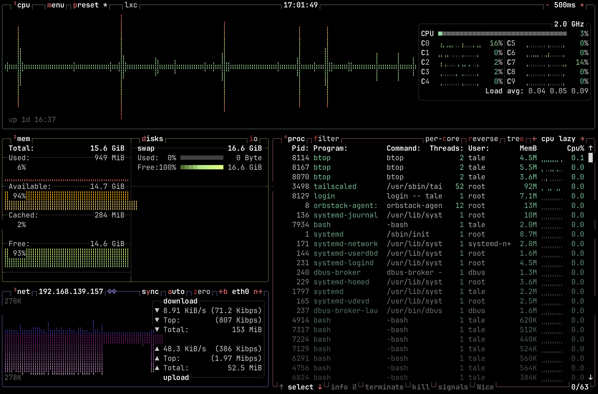
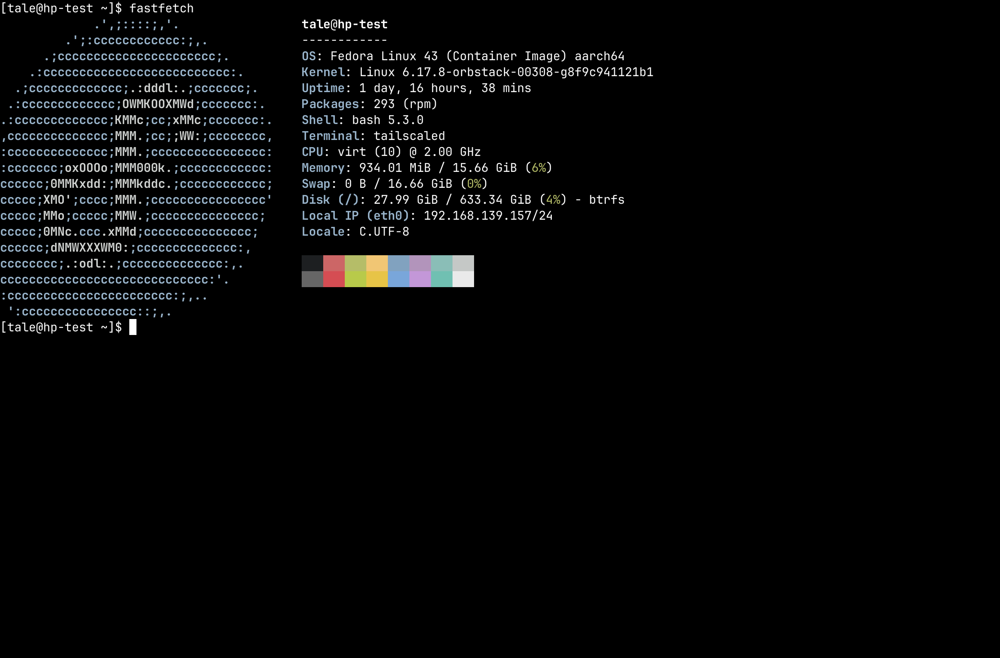

# Browser SSH

<figure>
  
  <figcaption><code>btop</code> running over browser SSH</figcaption>
</figure>

Browser SSH allows a user to open an SSH session to any accesible node in the
Tailnet directly from the browser. It spins up an ephemeral Tailscale node that
joins the tailnet for the duration of the SSH session.

<figure>
  
  <figcaption><code>fastfetch</code> with Nerd Font icons</figcaption>
</figure>

## Prerequisites

- **Headscale 0.28 or newer** is required.
- Target nodes must have **Tailscale SSH** enabled (`tailscale up --ssh`).
- Users must be logged-in via **OIDC** (API key logins cannot use browser SSH).
- The **Headplane Agent** must be [enabled and configured](/features/agent).

## How It Works

:::tip
While we use Ghostty (via [restty](https://restty.dev)) to render the terminal,
the SSH connection is opened with a `TERM` value of `xterm-256color` for maximum
compatibility. Nerd Font glyphs are supported out of the box — the terminal
ships with a self-hosted JetBrains Mono Nerd Font.
:::

When a user opens an SSH session from the UI, the browser:

1. Loads a WASM module that runs a minimal Tailscale node using userspace
   WireGuard. This node will connect to the tailnet via a pre-auth key.
2. Opens an SSH session to the target node's Tailscale IP address over the
   tunnel and passes it to the browser.
3. Using [restty](https://restty.dev) (a Ghostty-based WASM terminal emulator),
   the browser renders a full-featured terminal and proxies the SSH session
   to it.

## Reverse Proxy Configuration

Browser SSH requires that the browser can reach both **Headplane** and
**Headscale** directly. If either is behind a reverse proxy, the proxy must be
configured to support WebSocket connections — this is how the WASM node
communicates with DERP relay servers.

### Required Headers

Your reverse proxy must forward these headers for Headscale's DERP endpoint:

| Header                   | Value                                   |
| ------------------------ | --------------------------------------- |
| `Upgrade`                | `websocket`                             |
| `Connection`             | `Upgrade`                               |
| `Sec-WebSocket-Protocol` | forwarded as-is (Tailscale uses `derp`) |

### CORS Headers

Headscale must be accessible from the origin where Headplane is served. If
Headplane and Headscale are on different origins (different hosts or ports),
your reverse proxy must add CORS headers to Headscale responses:

| Header                         | Value                                           |
| ------------------------------ | ----------------------------------------------- |
| `Access-Control-Allow-Origin`  | The origin of your Headplane instance           |
| `Access-Control-Allow-Methods` | `GET, POST, OPTIONS`                            |
| `Access-Control-Allow-Headers` | `Content-Type, Upgrade, Sec-WebSocket-Protocol` |

### Example: Caddy

```caddyfile
# Headscale
hs.example.com {
    reverse_proxy localhost:8080

    # If Headplane is on a different origin:
    header Access-Control-Allow-Origin "https://headplane.example.com"
    header Access-Control-Allow-Methods "GET, POST, OPTIONS"
    header Access-Control-Allow-Headers "Content-Type, Upgrade, Sec-WebSocket-Protocol"
}
```

Caddy handles WebSocket upgrades automatically — no extra configuration needed.

### Example: nginx

```nginx
# Headscale
server {
    listen 443 ssl;
    server_name hs.example.com;

    location / {
        proxy_pass http://localhost:8080;
        proxy_http_version 1.1;
        proxy_set_header Upgrade $http_upgrade;
        proxy_set_header Connection "upgrade";
        proxy_set_header Host $host;

        # If Headplane is on a different origin:
        add_header Access-Control-Allow-Origin "https://headplane.example.com" always;
        add_header Access-Control-Allow-Methods "GET, POST, OPTIONS" always;
        add_header Access-Control-Allow-Headers "Content-Type, Upgrade, Sec-WebSocket-Protocol" always;
    }
}
```

### Same-Origin Setup

If Headplane and Headscale share the same origin (e.g. a single reverse proxy
routing `/admin` to Headplane and everything else to Headscale), CORS headers
are not needed. WebSocket upgrade forwarding is still required.

## Troubleshooting

### SSH Not Available

**Error:** "This version of Headplane was not built with browser SSH support."

The WASM assets (`hp_ssh.wasm` and `wasm_exec.js`) are missing. Rebuild with
`./build.sh --wasm` or ensure your Docker image was built with the `--wasm`
flag.

### Agent Required

**Error:** "Browser SSH is only available when the Headplane agent integration
is enabled."

The Headplane Agent is not enabled. Browser SSH depends on the agent for
Tailnet connectivity and ephemeral node cleanup. See the
[Agent documentation](/features/agent) for setup instructions.

### OIDC Required

**Error:** "Browser SSH is only available when OIDC authentication is enabled."

Browser SSH requires OIDC authentication to generate pre-auth keys tied to a
Headscale user. API key logins do not have an associated Headscale user
identity. Log in via your configured OIDC provider instead.

### User Not Linked

**Error:** "You'll need to link your user account to a Headscale user before
you can use Browser SSH."

Your OIDC account does not match any user in Headscale. You must authenticate
with Headscale at least once before using Browser SSH, so that a Headscale
user is created and linked to your OIDC identity.

### Node Not Found

**Error:** "No node found with hostname ..."

The node name in the URL does not match any node registered in Headscale. The
node may have been renamed or removed. Navigate back to the machines list and
try again.

### Node Offline

Headplane checks whether the target node is connected to the Tailnet before
attempting an SSH session. If the node is offline, you'll see an error page
with a **Retry Connection** button. Ensure the node is running and connected
to Headscale, then retry.

### Connection fails with EOF or hangs

- **Check `server_url` in your Headscale config.** If Headscale runs on a
  non-standard port, `server_url` must include it (e.g.
  `https://hs.example.com:8443`). The embedded DERP server derives its
  advertised port from this value. Do **not** put the DERP port in Headplane's
  `headscale.public_url` — that setting is used for display in the UI and
  changing it will break registration commands and auth key instructions.
- **Verify reverse proxy WebSocket support.** The proxy in front of Headscale
  must forward `Upgrade: websocket` headers. Without this, the DERP connection
  will fail immediately.
- **Check CORS if on different origins.** Open the browser console and look for
  CORS errors. If Headplane and Headscale are on different origins, CORS headers
  must be configured on Headscale's proxy.
- Verify that the target node has Tailscale SSH enabled (`tailscale up --ssh`).
- Check the browser console for WASM errors or DERP connection failures.

### "failed to look up local user \*"

This error appears in the terminal when Headscale SSH ACLs use
`"users": ["*"]`, which some Tailscale versions interpret as a literal
username rather than a wildcard. To fix this, change your ACL SSH rules to
use `"autogroup:nonroot"` or explicit usernames instead:

```jsonc
// Before (broken on some versions)
{ "action": "accept", "src": ["autogroup:member"], "dst": ["autogroup:self"], "users": ["*"] }

// After (recommended)
{ "action": "accept", "src": ["autogroup:member"], "dst": ["autogroup:self"], "users": ["autogroup:nonroot"] }
```

### Terminal opens but input doesn't work

- Ensure the target node's Tailscale SSH ACLs permit the user. The SSH
  connection succeeds at the transport level but the session may be rejected
  by the node's SSH policy.
- Check that the username you entered is a valid Linux user on the target
  node. If the user doesn't exist, the SSH session will appear to connect
  but immediately fail.

### "SSH error: ssh: handshake failed: ssh: no common algorithm"

The target node's SSH server doesn't support any of the algorithms offered
by the Go SSH client. This usually means the target node is running a very
old or very new version of OpenSSH with non-default algorithm configuration.
Updating Tailscale on the target node typically resolves this.

### SSH session connects but immediately disconnects

- The target node may not have an SSH server installed or running. Tailscale
  SSH (`tailscale up --ssh`) runs its own SSH server, but if Tailscale SSH
  is not enabled, the node needs a standard SSH server (e.g. `openssh-server`)
  listening on port 22.
- The node may have a firewall blocking port 22 even for Tailnet connections.
