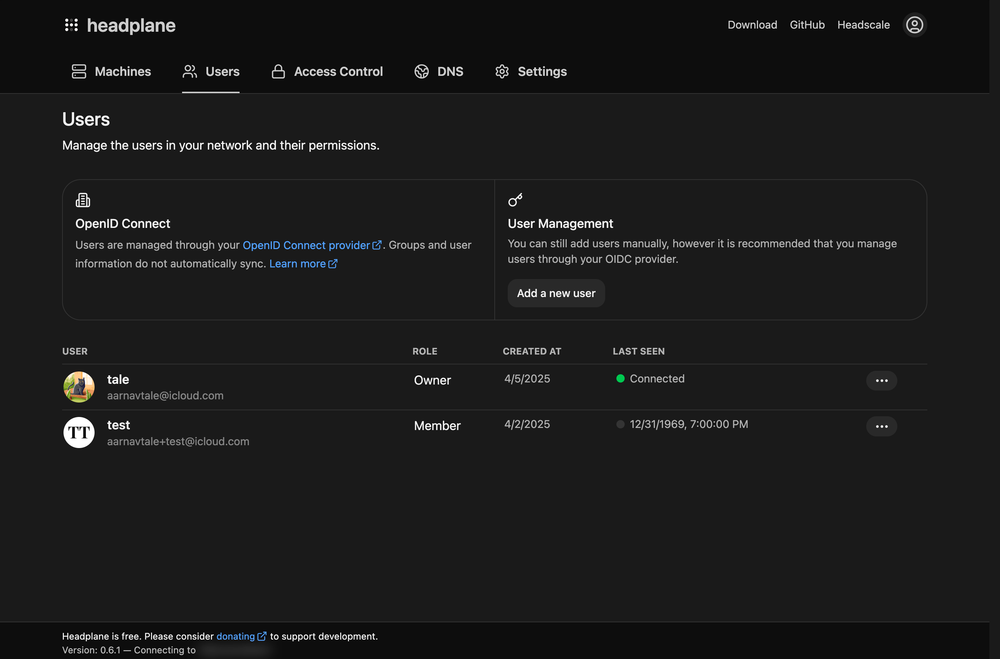

# Single Sign-On (SSO)

<figure>
    
    
    <figcaption>SSO Configuration Page</figcaption>
</figure>

Single Sign-On allows users to authenticate with Headplane through an external
Identity Provider (IdP). It does this using the OpenID Connect (OIDC) protocol,
which is widely supported by many popular IdPs.

## Getting Started
To set up Single Sign-On (SSO) with Headplane, there are several steps involved.
As a general recommendation, please read through the entire guide before
beginning the process as there are several important factors to consider.

### Requirements

::: warning
If you are also using OpenID Connect (OIDC) authentication with Headscale, it is
**fundamentally important** that both Headscale and Headplane are configured to
use the *exact same client* in your Identity Provider (IdP). This means that
both services should share the same client ID and secret.

This is necessary because Headplane relies on the user IDs provided by the IdP
to match users with their equivalent Headscale users. If Headscale and Headplane
are using different clients, the user IDs may not match up correctly, preventing
a user from viewing their devices in Headplane.
:::

You'll need the following things set up before proceeding:
- A working Headplane installation that is already configured.
- An Identity Provider (IdP) that supports OAuth2 and OpenID Connect (OIDC).
- `server.base_url` set to the public URL of your Headplane instance in your
configuration file (ie. the domain that's visible in the browser).
- A Headscale API key with a relatively long expiration time (eg. 1 year).

### Configuring the Client
You'll need to create a client in your Identity Provider (IdP) that Headplane
can use for authentication. A part of that step involves giving an allowed
"redirect URL" to your IdP. This URL is where the IdP will send users back to
after they have authenticated.

For Headplane, the redirect URL will be in the following format, where the
domain is replaced with the value set for `server.base_url` in your Headplane
configuration:

```
https://headplane.example.com/admin/oidc/callback
```

Once you have created the client in your IdP, make note of the following
information as you'll need it for the Headplane configuration:
- Client ID
- Client Secret (if applicable)
- Issuer URL

### OIDC Configuration
To enable OIDC authentication in Headplane, you'll need to add the necessary
configuration options via the file or environment variables. See below:

```yaml
oidc:
  headscale_api_key: "<generated-api-key>"
  issuer: "https://your-idp.com"
  client_id: "your-client-id"
  client_secret: "your-client-secret"
  # You can also provide the client secret via a file:
  # client_secret_path: "${HOME}/secrets/headplane_oidc_client_secret.txt"

  # Those options should generally be sufficient, but you can also set these:
  # authorization_endpoint: ""
  # token_endpoint: ""
  # userinfo_endpoint: ""
  # scope: "openid email profile"
  # extra_params:
  #  foo: "bar"
  #  baz: "qux"
```

Headplane automatically tries to discover the necessary OIDC endpoints but if
your IdP does not support discovery, you may need to manually specify them.

### PKCE

::: warning
Headplane currently only supports the **`S256`** code challenge method for PKCE.
You may need to ensure that your Identity Provider is configured to accept this
method.
:::

By default, Headplane does not use PKCE (Proof Key for Code Exchange) when
communicating with the Identity Provider. PKCE is generally a best practice for
OIDC and can enhance security. *Some Identity Providers may even require PKCE
to be used.* To enable PKCE you'll need to set `oidc.use_pkce`
to `true` in your Headplane configuration file:

```yaml
oidc:
  use_pkce: true
```

## Troubleshooting
Some of the common issues you may encounter when configuring OIDC with Headplane
include:

- **Invalid API Key**: Ensure that the API key provided to Headplane is valid
and has not expired.
- **Missing [some]_endpoint**: If your IdP does not provide standard OIDC
endpoints, you may need to manually specify them in the Headplane configuration.
- **Missing the `sub` claim**: Ensure that your IdP is configured to include the
`sub` claim in the ID token, as this is required for Headplane to identify users.
- **Redirect URI Mismatch**: Ensure that the redirect URI configured in your IdP
and that `server.base_url` in Headplane match exactly.
- **Cookie Issues**: The OIDC authentication relies on your cookie configuration
for Headplane. If OIDC cannot complete due to a missing session or invalid
session then please check your cookie settings.
