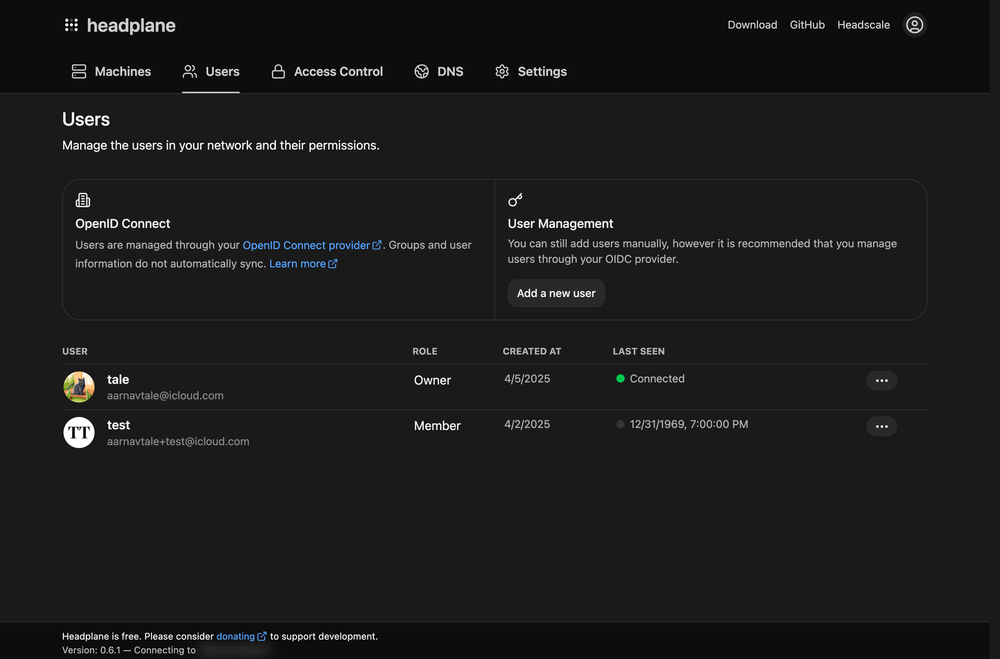
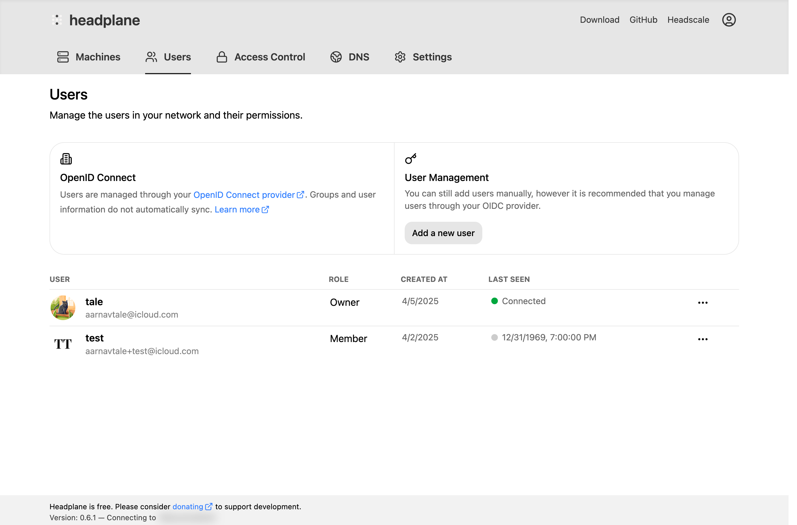

# Single Sign-On (SSO)

<figure>
    
    
    <figcaption>SSO Configuration Page</figcaption>
</figure>

Single Sign-On allows users to authenticate with Headplane through an external
Identity Provider (IdP) using the OpenID Connect (OIDC) protocol. When enabled,
users sign in through your IdP and Headplane automatically links them to their
Headscale identity, assigns a role, and manages their session.

## Getting Started

### Requirements

You'll need the following before proceeding:

- A working Headplane installation that is already configured.
- An Identity Provider (IdP) that supports OAuth2 and OpenID Connect (OIDC).
- `server.base_url` set to the public URL of your Headplane instance in your
  configuration file (the domain visible in the browser).
- A Headscale API key with a relatively long expiration time (eg. 1 year).

### Configuring the Client

You'll need to create a client in your Identity Provider that Headplane can use
for authentication. As part of that step, you'll need to register a "redirect
URL" — this is where the IdP sends users after they authenticate.

For Headplane, the redirect URL will be in the following format (replace the
domain with the value set for `server.base_url`):

```
https://headplane.example.com/admin/oidc/callback
```

Once you have created the client, make note of the following:

- Client ID
- Client Secret (if applicable)
- Issuer URL

### OIDC Configuration

To enable OIDC authentication in Headplane, add the following to your
configuration file:

```yaml
headscale:
  url: "http://headscale:8080"
  api_key: "<generated-api-key>"

oidc:
  issuer: "https://your-idp.com"
  client_id: "your-client-id"
  client_secret: "your-client-secret"
  # You can also provide the client secret via a file:
  # client_secret_path: "${HOME}/secrets/headplane_oidc_client_secret.txt"

  # These are usually auto-discovered, but can be set manually:
  # authorization_endpoint: ""
  # token_endpoint: ""
  # userinfo_endpoint: ""
  # scope: "openid email profile"
  # subject_claims: ["open_id", "email"]
  # allow_weak_rsa_keys: false
  # extra_params:
  #  foo: "bar"
```

Headplane automatically discovers OIDC endpoints from your issuer's
`/.well-known/openid-configuration`. If your IdP does not support discovery,
you'll need to set the endpoints manually.

### Non-standard Subject Claims

Some providers do not return the standard OIDC `sub` claim in the ID token.
Headplane always uses `sub` first, but you can configure fallback claims with
`oidc.subject_claims`.

For Feishu/Lark, the recommended configuration is:

```yaml
oidc:
  subject_claims: ["open_id", "email"]
```

This keeps identity matching stable by preferring `open_id` and only falling
back to `email` if needed.

### Legacy Weak RSA Signing Keys

Some legacy providers still sign ID tokens with RSA keys smaller than 2048
bits. Headplane rejects those keys by default.

If your provider cannot rotate to a stronger signing key yet, you can
explicitly enable the compatibility fallback:

```yaml
oidc:
  allow_weak_rsa_keys: true
```

::: warning
This weakens ID token verification security and should only be used as a
temporary workaround while your provider rotates to a 2048-bit-or-larger key.
:::

### PKCE

::: warning
Headplane currently only supports the **`S256`** code challenge method for PKCE.
You may need to ensure that your Identity Provider is configured to accept this
method.
:::

By default, Headplane does not use PKCE (Proof Key for Code Exchange). PKCE is
a best practice for OIDC and enhances security — some IdPs even require it. To
enable PKCE:

```yaml
oidc:
  use_pkce: true
```

## How User Matching Works

When a user signs in via OIDC, Headplane needs to link them to their
corresponding Headscale user. This is important for features like showing a
user's own machines, self-service pre-auth keys, and WebSSH.

### Matching Strategy

Headplane uses a two-step matching strategy:

1. **Subject match (primary)**: Headscale stores the IdP's `provider_id` for
   each OIDC user (e.g. `https://idp.example.com/3d6f6e3f-...`). Headplane
   extracts the last path segment and compares it to the resolved OIDC subject.
   The resolved subject uses `sub` first, then falls back to any configured
   `oidc.subject_claims`. If they match, the user is linked.

2. **Email match (fallback)**: If the subject doesn't match, Headplane falls
   back to comparing the user's email address from the OIDC `userinfo` endpoint
   against the email stored on the Headscale user record.

Once a link is established, it's stored as a `headscale_user_id` in Headplane's
database and reused on subsequent logins — so the matching only needs to succeed
once.

### Headscale Without OIDC

If your Headscale instance uses **local users** (created via
`headscale users create`) rather than OIDC, automatic matching cannot work —
local users have no `provider_id` or email to compare against.

In this case, Headplane will prompt the user during onboarding to manually
select which Headscale user they are. This selection is persisted, so it only
needs to happen once. After linking, all ownership-based features (viewing your
own machines, self-service pre-auth keys, WebSSH) work normally.

::: tip
If you skip the user selection during onboarding, you can still use Headplane
— you just won't have ownership-based features. An admin can manage everything
regardless of whether users are linked.
:::

### Same Client vs. Different Clients

::: tip Recommended
Using the **same OIDC client** for both Headscale and Headplane is the simplest
and most reliable setup. The `sub` claim will be identical for both services,
so subject matching always works.
:::

If your Headscale and Headplane use **different OIDC clients**, some Identity
Providers (notably Azure AD / Entra ID) may issue different `sub` values per
client application. In this case:

- Subject matching will fail on the first login.
- Headplane will fall back to email matching, which requires that the `email`
  claim is available from both your IdP's `userinfo` endpoint and Headscale's
  user record.
- Once the link is established, subsequent logins will work regardless because
  the link is persisted.

::: warning
If you use different clients **and** your IdP does not provide an `email` claim,
Headplane will not be able to match users to their Headscale identity. Users
will still be able to sign in, but they won't be linked to a Headscale user —
meaning features like viewing their own machines or self-service pre-auth keys
won't work.
:::

## Roles and Permissions

When SSO is enabled, Headplane uses a role-based access control system to
determine what each user can do in the UI.

### Available Roles

| Role              | Description                                                                                            |
| ----------------- | ------------------------------------------------------------------------------------------------------ |
| **Owner**         | Full access to everything. Cannot be reassigned. Automatically granted to the first user who signs in. |
| **Admin**         | Full access except the owner-specific flag. Can manage all users, machines, ACLs, DNS, and settings.   |
| **Network Admin** | Can manage ACLs, DNS, and network settings. Can view machines and users. Can generate pre-auth keys.   |
| **IT Admin**      | Can manage machines, users, and feature settings. Can configure IAM. Cannot modify ACLs or DNS.        |
| **Auditor**       | Read-only access to everything. Can generate their own pre-auth keys.                                  |
| **Viewer**        | Can view machines and users. Can generate their own pre-auth keys.                                     |
| **Member**        | No UI access. The user exists in Headplane's database but has not been granted any permissions.        |

### First Login (Owner Bootstrap)

The very first user to sign in via OIDC is automatically assigned the **Owner**
role. All subsequent users are assigned the **Member** role (no access) by
default. An owner or admin must then assign them an appropriate role through
the Users page.

### API Key Sessions

Users who sign in with a Headscale API key (instead of OIDC) are treated as
having full access. API key sessions bypass the role system entirely since
possession of the API key already implies administrative access to Headscale.

### Onboarding

When a new OIDC user signs in for the first time, they go through a brief
onboarding flow that helps them connect their first device to the Tailnet. This
flow can be skipped. Once completed, users are taken to the main dashboard.

## Single Logout (RP-Initiated Logout)

Headplane supports
[OpenID Connect RP-Initiated Logout](https://openid.net/specs/openid-connect-rpinitiated-1_0.html).
When enabled, clicking "Log Out" in the UI from an OIDC-backed session will:

1. Destroy the local Headplane session.
2. Redirect the browser to the identity provider's `end_session_endpoint`.
3. Pass along the original `id_token` as `id_token_hint`, plus a
   `post_logout_redirect_uri` so the IdP can return the user to Headplane after
   it has cleared its own session.

### Configuration

This feature is **disabled by default** because the `post_logout_redirect_uri`
must be pre-registered in your OIDC client on the IdP. Enabling it without that
registration will land users on the provider's error page after logout.

To enable it, set `oidc.use_end_session: true`:

```yaml
oidc:
  # Required: opt in to RP-initiated logout
  use_end_session: true

  # Optional: override the auto-discovered end_session_endpoint, or set it
  # manually if your provider does not expose it via discovery.
  # end_session_endpoint: "https://idp.example.com/realms/main/protocol/openid-connect/logout"

  # Optional. Defaults to `<server.base_url>/admin/login?s=logout`.
  # post_logout_redirect_uri: "https://headplane.example.com/admin/login?s=logout"
```

If your provider exposes `end_session_endpoint` in its discovery document
(Keycloak, Authentik, Auth0, Azure AD, …) Headplane picks it up automatically
once `use_end_session` is `true`.

::: tip
Make sure the redirect URI you supply (or the default one Headplane builds) is
listed under the post-logout / valid redirect URIs in your IdP's client
configuration, otherwise the provider will refuse to redirect back.
:::

When `use_end_session` is `false` (the default), Headplane simply destroys its
own session and returns the user to the login page.

## Troubleshooting

### Common Issues

- **"OIDC is not enabled or misconfigured"**: Check that your `oidc` section
  is present in the config and that the issuer URL is reachable from the
  Headplane server.

- **User signs in but can't see their machines**: The user's Headscale identity
  wasn't matched. Check that either the `sub` claim matches or the `email`
  claim is available (see [How User Matching Works](#how-user-matching-works)).

- **"Session cookie is empty" or login loop**: Check your `cookie_secure`
  setting. If Headplane is behind a reverse proxy with HTTPS, set it to `true`.
  If running without HTTPS (eg. local development), set it to `false`.

- **Invalid API Key**: The `headscale.api_key` may have expired. Generate
  a new one with `headscale apikeys create --expiration 999d`.

- **Missing the `sub` claim**: If your IdP omits `sub`, configure
  `oidc.subject_claims` with a stable fallback such as `open_id`. Only use
  `email` as a fallback when it is stable for your users.

- **Redirect URI Mismatch**: Ensure the redirect URI registered in your IdP
  matches `{server.base_url}/admin/oidc/callback` exactly.

- **PKCE errors**: If your IdP requires PKCE, set `oidc.use_pkce: true`. If
  you see errors mentioning `code_verifier`, this is almost always the cause.

- **Missing endpoints**: If your IdP does not support OIDC discovery, you'll
  need to set `authorization_endpoint`, `token_endpoint`, and
  `userinfo_endpoint` manually in the config.
