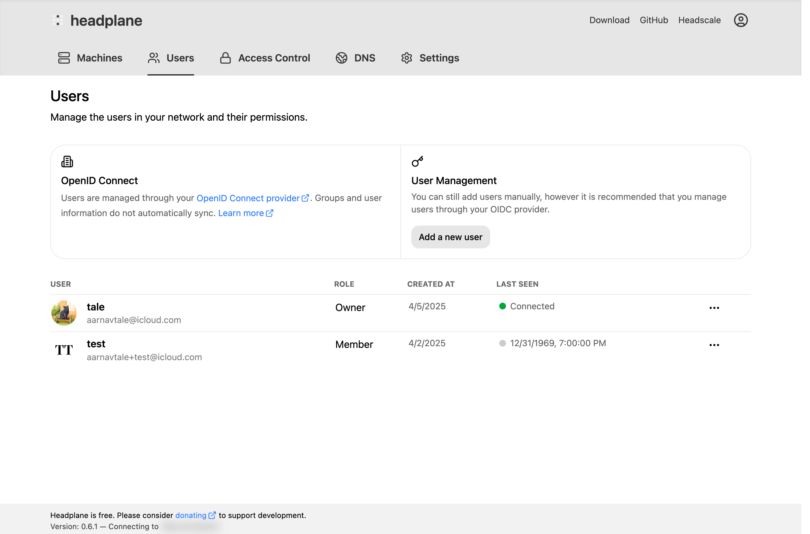

# Single Sign-On (SSO)

<figure>
    
    
    <figcaption>SSO Configuration Page</figcaption>
</figure>

Headplane supports Single Sign-On (SSO) authentication using OpenID Connect
(OIDC). This allows users to authenticate using an external Identity Provider
(IdP) that supports OIDC, streamlining the login process and enhancing security.

This is generally the recommended authentication method when using Headplane in
production environments as it provides the deepest integration with Headscale
and allows for seamless user management.

## Configuring OIDC
To configure Single Sign-On (SSO) you'll need to first setup a client with your
Identity Provider that supports OIDC. The exact steps to do this will vary, but
generally you'll need to be able to provide the following information to
Headplane:

| Field                     | Description                                      |
|---------------------------|--------------------------------------------------|
| **Client ID**             | The client identifier provided by your IdP.      |
| **Client Secret**         | The client secret provided by your IdP.          |
| **Issuer URL**            | The OIDC issuer URL given by your IdP.           |

::: tip
If you are using a custom prefix other than `/admin` for the Headplane web UI,
please ensure that you adjust the redirect URL accordingly when setting up
your OIDC client.
:::

Before creating the client, configure Headplane to use a redirect URL that your
IdP will accept. You'll need to set **`server.base_url`** to the public URL of your
Headplane instance in your configuration file. For example, if your Headplane
instance runs on `https://headplane.example.com/admin`, set:

```yaml
server:
  base_url: "https://headplane.example.com"
```

and provide the following redirect URL to your IdP when creating the client:

```
https://headplane.example.com/admin/auth/callback
```

### Headscale API Key
Once you have created the client with your IdP, you'll need to generate an API
key for Headplane to use when communicating with Headscale. You can do this by
running `headscale apikeys create -e 1y` to create an API key that is valid for
one year (you can adjust the expiration as needed). Make sure to copy the
generated API key as you will need it for the Headplane configuration.


### Headplane Configuration
Finally, you can configure Headplane to use OIDC by adding the following fields
to your Headplane configuration file:

```yaml
oidc:
  issuer: "https://your-idp.com"
  client_id: "your-client-id"
  client_secret: "your-client-secret"
  headscale_api_key: "<generated-api-key>"

  # Those options should generally be sufficient, but you can also set these:
  # authorization_endpoint: ""
  # token_endpoint: ""
  # userinfo_endpoint: ""
  # scope: "openid email profile"
  # extra_params:
  #  foo: "bar"
  #  baz: "qux"
```

## Troubleshooting
Some of the common issues you may encounter when configuring OIDC with Headplane
include:

- **Invalid API Key**: Ensure that the API key provided to Headplane is valid
and has not expired.
- **Missing [some]_endpoint**: If your IdP does not provide standard OIDC
endpoints, you may need to manually specify them in the Headplane configuration.
- **Missing the `sub` claim**: Ensure that your IdP is configured to include the
`sub` claim in the ID token, as this is required for Headplane to identify users.
- **Redirect URI Mismatch**: Ensure that the redirect URI configured in your IdP
and that `server.base_url` in Headplane match exactly.
- **Cookie Issues**: The OIDC authentication relies on your cookie configuration
for Headplane. If OIDC cannot complete due to a missing session or invalid
session then please check your cookie settings.
