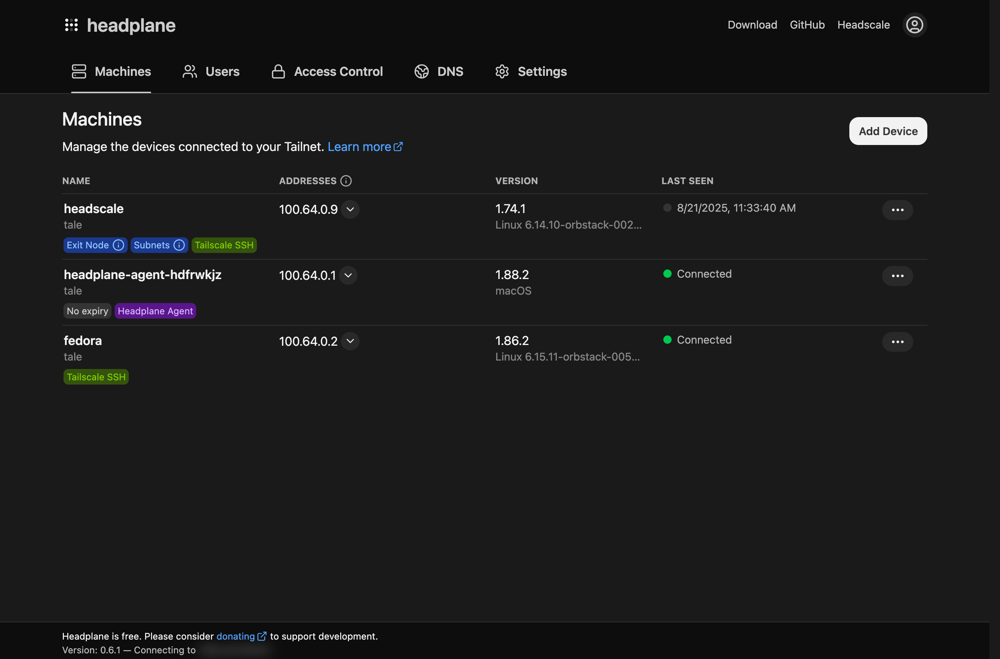
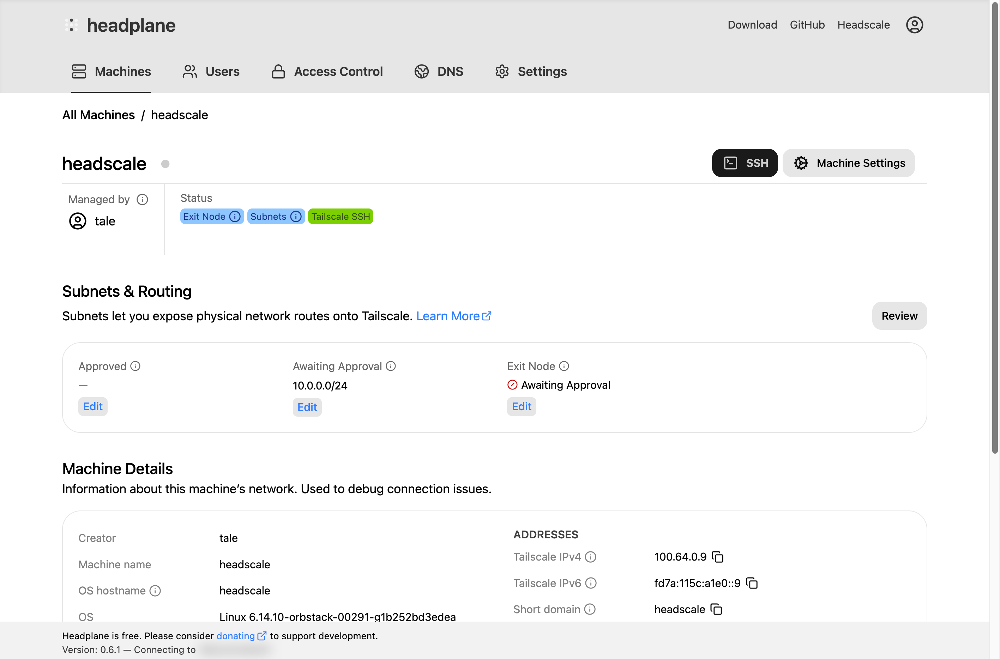

# What is Headplane (and Headscale)?

Headplane is a web-based UI that bridges the transforms Headscale into a
feature-rich VPN platform that rivals Tailscale's official offering. Headscale
is a self-hosted implementation of the Tailscale control server, enabling users
to create and manage their own private VPN networks via the Tailscale client.

<figure>
    
    
    <figcaption>Headplane Dashboard</figcaption>
</figure>

Headscale does not ship with any web UI by default, which is where Headplane
comes in. Headplane provides a comprehensive web interface for managing your
Headscale instance, allowing you to easily administer your nodes, networks, and
ACLs.

It goes beyond basic management features, offering advanced capabilities such as
remote web-based SSH access to your nodes, single sign-on (SSO) via OpenID
Connect (OIDC), and detailed insights into your Tailnet's configuration and
status. Things like DNS management, ACL editing, and Headscale configuration can
all be done directly from the Headplane UI when compared to other Headscale UIs.

<figure>
    
    
    <figcaption>DNS management in Headplane</figcaption>
</figure>

Headplane aims to replicate the functionality offered by the official Tailscale
product and dashboard, being one of the most feature complete Headscale UIs available.
These are some of the features that Headplane offers:

- Machine management, including expiry, network routing, name, and owner management
- Access Control List (ACL) and tagging configuration for ACL enforcement
- Support for OpenID Connect (OIDC) as a login provider
- The ability to edit DNS settings and automatically provision Headscale
- Configurability for Headscale's settings

<figure>
    
    
    <figcaption>Machine management in Headplane</figcaption>
</figure>
